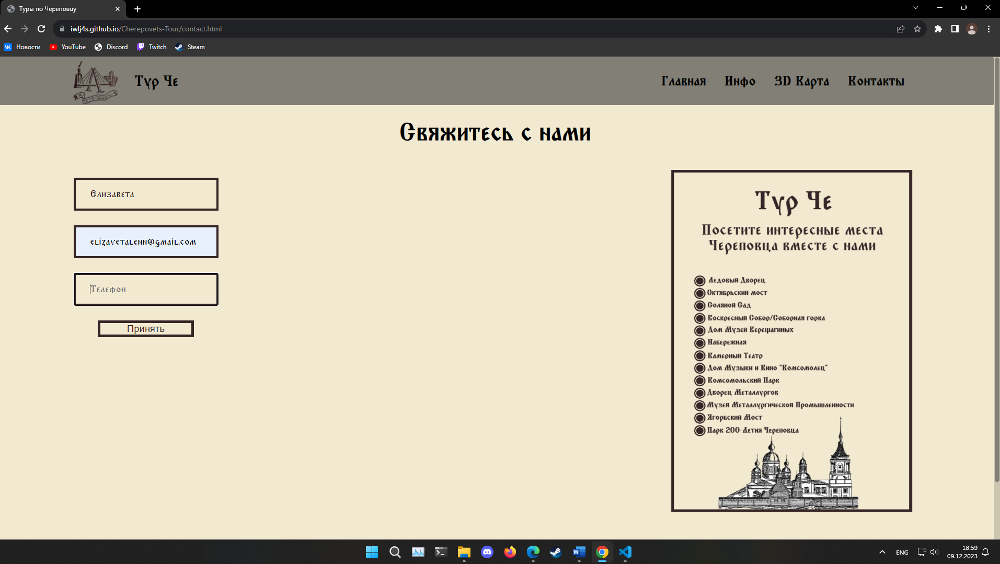

<H1 id="up" align="center" > Тур по Череповцу</H1>

  
Содержание

  <ol >
    <li >
      <a href="#info">О Проекте</a>
      <ul>
        <li><a href="#build_with">Использовалось при создании</a></li>
      </ul>
    </li>
    <li><a href="#illustration">Иллюстрации</a></li>
    <li><a href="#install">Использование</a></li>
  </ol>

<H2 id="info"> Основная информация</H2>
Проект для колледжа (ЧЛМТ), выполинла студентка ИС-31 Ленникова Елизавета Александровна

<H3 id="build_with"> Использовано при создании: </H3>

* <a href="https://yandex.ru/maps-api/products/js-api">API Яндекс Карты</a>

<H2 id="illustration"> Иллюстрации </H2>

<H2 id="install"> Использование </H2>

link ==> https://iwlj4s.github.io/Cherepovets-Tour/main.html
